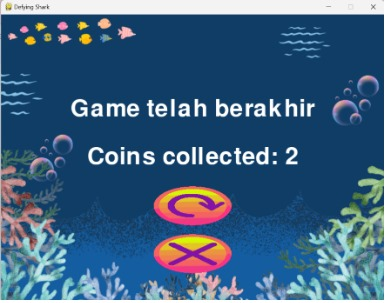

# Laporan Tugas Besar Pemrograman Berorientasi Objek
## "Defying Sharks"

### Kelompok 4:

- 122140206 Alfonso Pangaribuan
- 122140184 Dina Rahma Dita
- 122140185 Luthfianya I.R
- 122140166 Handayani
- 122140192 Novia Listiani

### Program Studi Teknik Informatika
### Fakultas Teknologi Industri
### Institut Teknologi Sumatera
### 2024

## Daftar Isi

1. [Deskripsi Penugasan](#deskripsi-penugasan)
2. [Nama Game](#nama-game)
3. [Kategori Game](#kategori-game)
4. [Entitas](#entitas)
5. [Deskripsi Game](#deskripsi-game)
6. [Tampilan Game](#tampilan-game)
7. [Kelas](#kelas)
8. [Objek](#objek)
9. [Enkapsulasi](#enkapsulasi)
10. [Pewarisan](#pewarisan)
11. [Polimorfisme](#polimorfisme)
12. [Abstraksi](#abstraksi)
13. [Penanganan Kesalahan](#penanganan-kesalahan)
14. [Graphical User Interface](#graphical-user-interface)
15. [Diagram Unified Modeling Language](#diagram-unified-modeling-language)
16. [Kode](#kode)
17. [Lampiran](#lampiran)

## Deskripsi Penugasan

Nama | Deskripsi Penugasan
--- | ---
Alfonso Pangaribuan | Konsep awal game, fitur game, membuat koding penyempurnaan dari basis game, Pembuatan UML, Pembuatan Laporan GUI
Dina Rahma Dita | Konsep awal game, fitur game, membuat kodingan awal basis game dibuat, Pembuatan UML, Pembuatan Laporan penanganan kesalahan
Handayani | Konsep fitur tambahan game, membuat kodingan berdasarkan kelompok kelasnya, Pembuatan UML, Pembuatan Laporan
Novia Listiani | Desain latar belakang, hiu, gambar tombol dan Pembuatan Laporan
Luthfianya Isyathun R | Desain perenang, koin, hati, ramuan, tombol, halaman utama dan Pembuatan Laporan

## Nama Game

"Defying Sharks" mengandung filosofi tentang mengatasi tantangan dan meraih kemenangan melalui kecepatan. Sharks menggambarkan bahaya dan rintangan yang terus-menerus, yaitu hiu lapar yang mengintai. Defying menunjukkan sikap pantang menyerah dan melawan. Player tidak hanya menghindari hiu, tetapi secara aktif menantang bahaya tersebut. Singkatnya, judul ini menyampaikan pesan bahwa untuk meraih kemenangan, player harus berani menghadapi bahaya dan terus berakselerasi melewati berbagai rintangan.

## Kategori Game

Game ini menggabungkan elemen dari genre arcade dan survival. Hal ini membuatnya menjadi game yang menarik dan seru untuk dimainkan oleh berbagai kalangan.

## Entitas

Entitas | Tugas / Aktivitas
--- | ---
Player | Player akan berperan sebagai perenang yang terjebak di lautan penuh hiu lapar. Dengan kemampuan berenang, player dapat bermanuver menghindari serangan hiu. Namun, keterbatasan bergerak di air membuat player rentan. Tujuan utamanya adalah bertahan hidup dengan berenang menghindari hiu ke arah kanan, kiri, maju, dan mundur. Player juga bisa mencari koin dan akan diakumuluasi di menu utama. Permainan ini akan menyuguhkan pengalaman menegangkan dan penuh tantangan, memacu adrenalin player untuk terus berenang dan bertahan hidup.
Hiu | Hiu-hiu ini berperan sebagai rintangan yang digambarkan dengan tubuh besar, gigi tajam, dan beragam jenis. Agresif dan haus mangsa, mereka berenang dengan cepat dan menyerang dengan gigitan kuat. Didorong oleh insting predator dan rasa lapar, hiu ini menjadi bahaya yang mengancam para pemain.
Koin | Koin adalah benda berharga berbentuk bulat berwarna emas yang tersebar di lautan. Koin ini dapat dikumpulkan untuk mendapatkan poin. Koin menjadi elemen penting yang mendorong eksplorasi, pengumpulan, dan pencapaian skor tinggi.
Background | Sebagai latar belakang permainan dengan default adalah tema terang.
Button Start | Button merupakan elemen penting yang membantu pemain memulai permainan dan mengakses fitur-fitur di dalamnya. Button Start berguna untuk memulai permainan. Terletak di halaman utama game.
Button About | Button about berisi mengenai peraturan permainan, cara memainkan game, dan deskripsi permainan. Terletak di halaman utama game.
Button Shop | Button Shop: Membuka Shop di mana pemain dapat membeli berbagai item untuk meningkatkan kemampuan dan pengalaman bermain. Terletak di halaman utama game.
Nyawa | Nyawa disini digambarkan sebagai benda istimewa berbentuk hati merah yang muncul di arus air. Hati ini memberikan pemain satu nyawa tambahan, membantu mereka bertahan hidup lebih lama. Kehilangan 4 nyawa berarti pemain mati dan harus memulai kembali permainan dari awal. Kemunculan hati yang jarang dan acak menambah ketegangan.

## Deskripsi Game

Defying Sharks adalah game arcade dan survival di mana player melawan arus yang melaju kencang di lautan yang penuh dengan hiu lapar. Player harus menghindari hiu dan mengumpulkan koin untuk mendapatkan skor. Koin juga dapat digunakan untuk mengubah tema permainan. Player memiliki tiga nyawa, dan permainan akan berakhir jika semua nyawa hilang. Permainan ini memiliki grafis yang cerah dan penuh warna, gameplay yang cepat dan seru, dan musik yang menarik. Gameplay ini cukup menantang dan cepat, di mana player harus menghindari musuh dan mencapai kecepatan tinggi.

## Tampilan Game

### Gambar 1. Tampilan Awal Game


Tampilan awal game saat game dijalankan akan berupa latar belakang, tombol-tombol (start, about, dan shop), serta total skor. Saat game pertama kali dijalankan akan menampilkan background musik, tombol start berfungsi untuk memulai permainan, tombol about berfungsi untuk melihat aturan cara main, dan shop untuk membeli suatu tema. Tampilan total skor yang berada di pojok kanan atas berfungsi untuk melihat akumulasi koin yang telah kita dapatkan yang nantinya koin tersebut akan digunakan untuk membeli suatu tema.

### Gambar 2. Tampilan Menu About


Tampilan About berisi tentang deskripsi dari game “Defying Shark”. Pada laman About dijelaskan bagaimana aturan dalam bermain game. Hal yang harus dihindari dalam bermain game defying shark adalah hiu. Dan hiu akan selalu bertambah seiring dengan berjalannya waktu. Dilaman ini juga dijelaskan bahwa swimmer diberikan 4 nyawa yang tertera dengan logo “hati”. Ketika nyawa habis, maka game akan berakhir. Tombol yang harus ditekan untuk bermain, ketika game over, dan ingin melanjutkan permainan, dan untuk menuju laman utama.

### Gambar 3. Tampilan Main Game


Tampilan utama game saat laman utama tombol start ditekan maka akan menampilkan jalannya game. Pemeran utama game ini yaitu perenang, perenang dapat bergerak ke atas, bawah, kanan dan kiri menggunakan keyboard panah. Perenang harus menghindari hiu sebagai obstacle, hiu bergerak dari atas ke bawah dengan kemunculan hiu yang random (left, center, right) semakin lama perenang bertahan menghindari hiu maka kemunculan hiu akan semakin banyak.

Level yang berada di pojok kanan atas tampilan menunjukkan tingkat kesulitan kemunculan hiu, semakin tinggi levelnya, maka hiu yang muncul semakin banyak dan akan memenuhi layar. Terdapat koin yang bisa diambil perenang, koin akan diakumulasikan skor tersimpan di bagian pojok kiri atas. Terdapat 4 nyawa jika bertabrakan dengan hiu maka nyawa akan berkurang satu hingga akhirnya gameover. Namun dalam permainan, akan muncul logo hati yang muncul bersamaan dengan datangnya koin, namun frekuensi kemunculan nyawa tidak sebanyak frekuensi kemunculan koin. Fungsi dari logo hati ini sendiri sebagai tambahan nyawa pemain, sehingga pemain dapat bermain lebih lama dengan mengambil hati/nyawa tersebut.

### Gambar 4. Tampilan saat Game Over


Pada laman game over tampak terdapat dua button yang berguna untuk apabila pengguna ingin mengulang permainan dan bila pengguna ingin mengakhiri permainan. Pada laman ini game akan berhenti, akan tampil juga total koin yang didapatkan.

## Kelas

1. **Player (Pemain):**
    - Kelas ini merepresentasikan karakter pemain dalam permainan.
    - Constructor (`__init__`) menginisialisasi gambar dan posisi pemain, serta mengatur atribut animasi, status pergerakan, dan suara.
    - Metode `toggle_mute` mengatur status suara dalam permainan, memungkinkan untuk mem-pause dan melanjutkan musik.
    - Metode `update` mengatur logika pergerakan pemain berdasarkan input dari keyboard, membatasi pergerakan pemain agar tetap di dalam layar, dan mengatur animasi pemain.
    - Metode `pause_movement` menghentikan pergerakan pemain.
    - Metode `resume_movement` melanjutkan pergerakan pemain.
    - Metode `toggle_animation` mengatur status animasi pemain, memungkinkan untuk mem-pause dan melanjutkan animasi.

2. **Shark (Hiu):**
    - Kelas ini merepresentasikan karakter hiu dalam permainan.
    - Constructor (`__init__`) menginisialisasi gambar dan posisi hiu, serta mengatur atribut status pergerakan dan animasi hiu.
    - Metode `update` mengatur logika pergerakan hiu dan animasinya, serta memastikan hiu tetap berada dalam batas layar.

3. **Coin (Koin):**
    - Kelas ini merepresentasikan koin dalam permainan.
    - Constructor (`__init__`) menginisialisasi gambar dan posisi koin.
    - Metode `update` mengatur logika pergerakan koin.

4. **Heart (Nyawa):**
    - Kelas ini merepresentasikan nyawa dalam permainan.
    - Constructor (`__init__`) menginisialisasi gambar dan posisi nyawa.
    - Metode `update` mengatur logika pergerakan nyawa.

5. **Game (Permainan):**
    - Kelas ini mengatur seluruh jalannya permainan.
    - Constructor (`__init__`) menginisialisasi berbagai komponen permainan, termasuk pemain, hiu, koin, nyawa, serta atribut permainan lainnya.
    - Metode `run` menjalankan permainan dengan mengatur loop utama permainan.
    - Metode `handle_input` mengatur input dari pengguna.
    - Metode `update` mengatur pembaruan status permainan, termasuk pergerakan objek, deteksi tabrakan, dan pembaruan skor.
    - Metode `draw` mengatur penggambaran objek-objek permainan di layar.
    - Metode `show_game_over_screen` menampilkan layar game over dan memungkinkan pengguna untuk memulai permainan baru atau kembali ke menu utama.

## Objek

### Player
- Perilaku: berenang
- Status: bergerak, hidup/mati, posisi koordinat (x,y)

### Shark
- Perilaku: bergerak, menyerang
- Status: posisi koordinat (x,y), status serangan

### Coin
- Perilaku: muncul
- Status: posisi koordinat (x,y)

### Heart
- Perilaku: muncul
- Status: posisi koordinat (x,y)

## Enkapsulasi

### Player
- `self.x`, `self.y`: Posisi x dan y karakter pemain di layar permainan.
- `self.image`: Gambar atau sprite yang digunakan untuk merepresentasikan karakter pemain di layar.

### Shark
- `self.x`, `self.y`: Posisi x dan y karakter hiu di layar permainan.
- `self.image`: Gambar atau sprite yang digunakan untuk merepresentasikan karakter hiu di layar.

### Coin
- `self.x`, `self.y`: Posisi x dan y karakter koin di layar permainan.
- `self.image`: Gambar atau sprite yang digunakan untuk merepresentasikan karakter koin di layar.

### Heart
- `self.x`, `self.y`: Posisi x dan y karakter hati di layar permainan.
- `self.image`: Gambar atau sprite yang digunakan untuk merepresentasikan karakter hati di layar.

### Game
- `self.player`: Objek pemain dalam permainan.
- `self.sharks`: Daftar objek hiu dalam permainan.
- `self.coins`: Daftar objek koin dalam permainan.
- `self.hearts`: Daftar objek hati dalam permainan.
- `self.score`: Skor pemain dalam permainan.

## Pewarisan

- `Player`, `Shark`, `Coin`, dan `Heart` akan mewarisi sifat dan metode dari kelas dasar `Character`.

## Polimorfisme

- Metode `update` pada kelas `Player`, `Shark`, `Coin`, dan `Heart` menunjukkan polimorfisme dengan mengimplementasikan perilaku yang berbeda tergantung pada objek yang memanggil metode tersebut.
- Kelas `Game` mengatur berbagai objek dalam permainan menggunakan metode umum seperti `update` dan `draw`, tanpa mengetahui detail implementasi spesifik dari setiap objek.

## Abstraksi

- Abstraksi diterapkan dengan menyembunyikan detail implementasi dari logika permainan dan pergerakan karakter di balik antarmuka metode seperti `update`, `draw`, `handle_input`, dan `run`.
- Pemain tidak perlu mengetahui detail teknis tentang bagaimana pergerakan karakter diatur; mereka hanya berinteraksi dengan antarmuka pengguna dan kontrol permainan.

## Penanganan Kesalahan

- Mendeteksi tabrakan antara karakter pemain dan hiu menggunakan metode `check_collision`.
- Mendeteksi tabrakan antara karakter pemain dan koin menggunakan metode `check_collision`.
- Menampilkan pesan atau layar game over ketika karakter pemain bertabrakan dengan hiu.
- Menangani input pengguna yang tidak valid atau tidak diinginkan dengan memeriksa validitas input sebelum memprosesnya dalam metode `handle_input`.

## Graphical User Interface (GUI)

- Antarmuka pengguna grafis (GUI) permainan `Defying Sharks` didesain dengan elemen visual yang menarik dan intuitif.
- Menu utama permainan memiliki tombol `Start`, `About`, dan `Shop` yang memungkinkan pemain untuk memulai permainan, melihat informasi tentang permainan, dan mengakses toko dalam permainan.
- Selama permainan berlangsung, elemen GUI menampilkan skor pemain, level, nyawa, dan elemen-elemen permainan lainnya.
- Ketika permainan berakhir, layar game over menampilkan total koin yang diperoleh dan opsi untuk memulai permainan baru atau kembali ke menu utama.

## Diagram Unified Modeling Language (UML)

### Diagram Kelas

```plaintext
+------------------------+
|        Player          |
+------------------------+
| - x: int               |
| - y: int               |
| - image: Surface       |
+------------------------+
| + update(): void       |
| + toggle_mute(): void  |
| + pause_movement(): void|
| + resume_movement(): void|
| + toggle_animation(): void|
+------------------------+

+------------------------+
|        Shark           |
+------------------------+
| - x: int               |
| - y: int               |
| - image: Surface       |
+------------------------+
| + update(): void       |
+------------------------+

+------------------------+
|        Coin            |
+------------------------+
| - x: int               |
| - y: int               |
| - image: Surface       |
+------------------------+
| + update(): void       |
+------------------------+

+------------------------+
|        Heart           |
+------------------------+
| - x: int               |
| - y: int               |
| - image: Surface       |
+------------------------+
| + update(): void       |
+------------------------+

+------------------------+
|        Game            |
+------------------------+
| - player: Player       |
| - sharks: List[Shark]  |
| - coins: List[Coin]    |
| - hearts: List[Heart]  |
| - score: int           |
+------------------------+
| + run(): void          |
| + handle_input(): void |
| + update(): void       |
| + draw(): void         |
| + show_game_over_screen(): void |
+------------------------+
